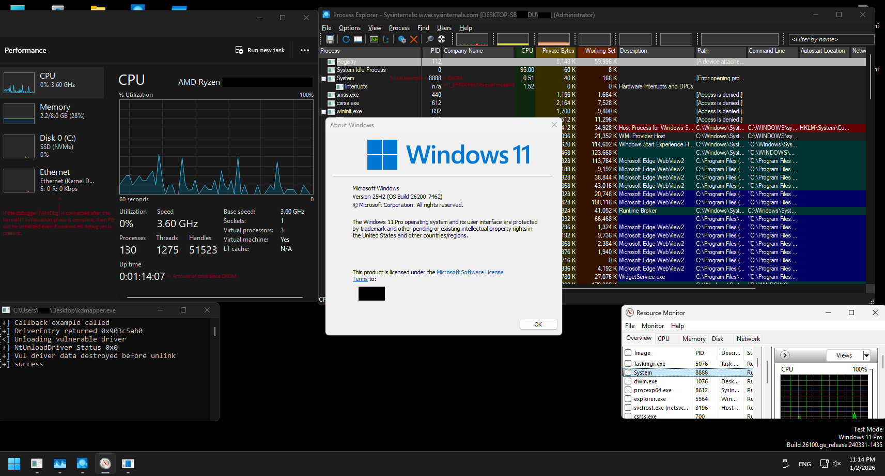

# TheiaPg - Runtime PatchGuard bypass w11-25h2

`TheiaPg` is an NT kernel module to prevent `PatchGuard` kernel integrity check routines from being performed before modification of critical kernel information (Critical-Kernel-Modules/Kernel-Objects) is detected and the irretrievable BugCheck-0109h (CRITICAL_STRUCTURE_CORRUPTION) `PatchGuard-BugCheck`.

## Module compatibility
                                      
TypesLoadSysImg: The module is fully compatible with loading sys-img methods: BYOVD(Mapping-Img, no dependency on unwind-info)/WinAPI.

HypervisorProtectEnvironment: The internal logic of the module is not compatible with hypervisor security (VBS/HVCI) because the module actively interacts with TablePages, and the access attributes of the GVA end PTE do not affect the attributes of the end PTE located on the EPT/NPT side, which means that the hardware access attributes to the PhysFrame will not be changed when modifying the Guest-End-PTE.

SecureBoot: Module is conditionally compatible with SecureBoot, using the BYOVD boot method, the module can be mapped to KernelSpace.

## Additional description

The module is not an exploit, but a logical neutralization using the information obtained about the internal structure of the PatchGuard KernelNT component during research.

Image module size with MSVC optimizations ~40kb.

# Result after the module testing session

# Support for me

BTC:bc1q6pmyefhmrr0ld4m67h3xv0n40d0szylnw5y5sq

ETH:0x9Dc8157B4Fd65840453438d8C0b60a09F9463f79

TRX:TUZQPQLFoFXANCXANVFSxc9FertD5TqbJt
